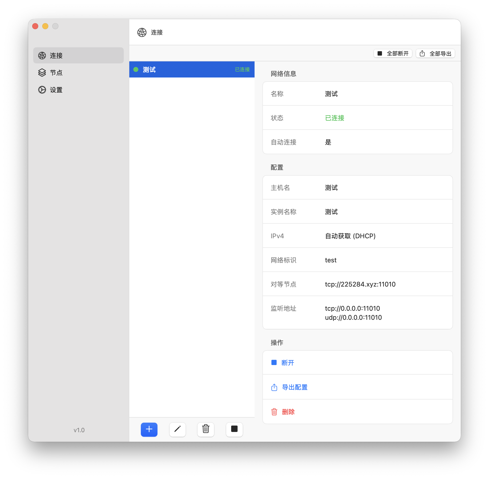
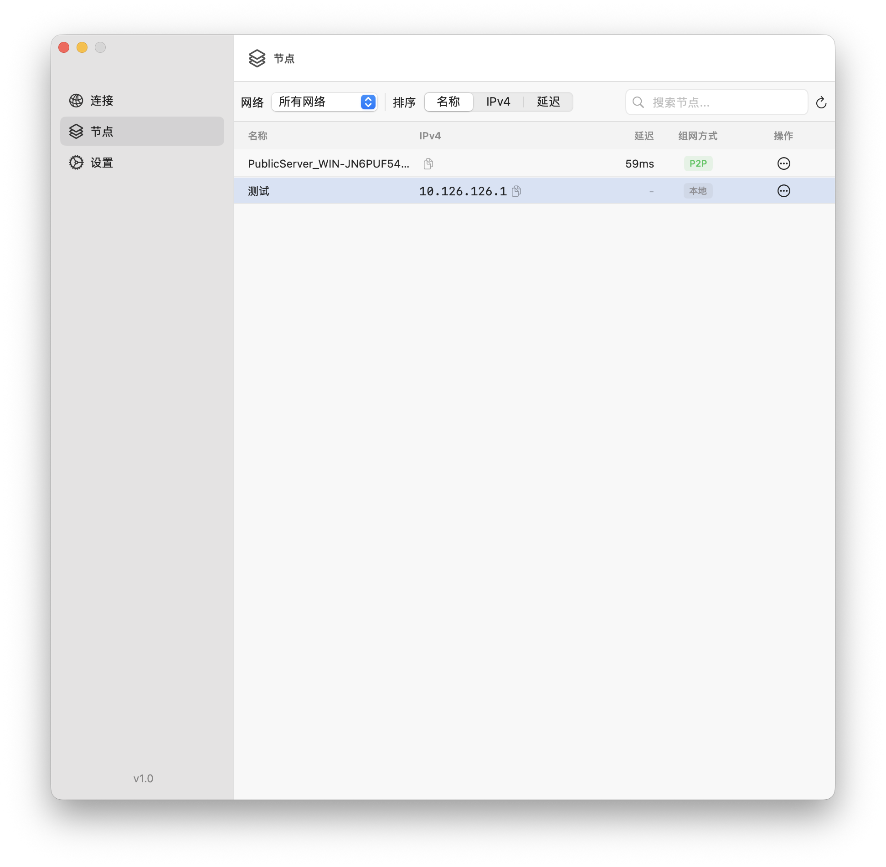
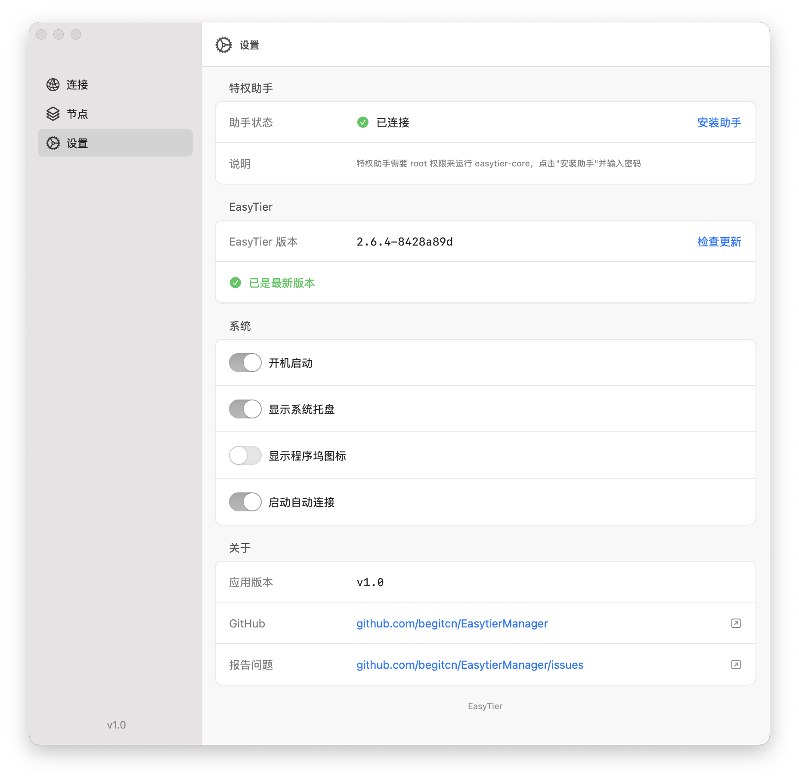

<div align="center">


# EasyTierManager

macOS 原生 GUI 管理器（SwiftUI + AppKit），用于管理 [EasyTier](https://github.com/EasyTier/Easytier) 虚拟组网。

<p>
  
  
  
  <a href="https://github.com/begitcn/EasyTierManager/releases" target="_blank" rel="noopener noreferrer">
    
  </a>
  <a href="https://github.com/begitcn/EasyTierManager/stargazers" target="_blank" rel="noopener noreferrer">
    
  </a>
</p>

</div>

---

> 本项目是一个纯 AI Vibe Coding 产物，全部代码由 AI 生成，未经人工审查。项目在需求梳理、架构设计、功能实现、文档维护等环节全程与 AI 协作。

## 截图

<div align="center">
  
  
  
</div>

## 功能

| 功能 | 说明 |
| --- | --- |
| 网络管理 | 可视化创建、编辑、删除 EasyTier 虚拟网络，自动生成 TOML 配置文件 |
| 一键启停 | 启动/停止单个或全部网络，支持优雅关闭（SIGTERM → SIGKILL） |
| 节点监控 | 实时查看节点在线状态、延迟、路由成本，支持搜索与筛选 |
| 自动连接 | 应用启动时自动连接指定网络，支持单网与全局开关 |
| 核心更新 | 自动检测 EasyTier 最新版本，一键下载并嵌入应用 |
| 导入/导出 | 支持 .toml / .yaml 配置文件导入，批量或单条导出 |
| 端口检测 | 创建网络时自动检测监听端口冲突，避免配置错误 |
| 系统托盘 | 菜单栏快捷操作，支持独立切换程序坞图标与菜单栏图标 |
| 开机启动 | 通过 SMAppService 原生 API 注册登录项 |

## 系统要求

- macOS Ventura (13.0) 及以上
- Apple Silicon (arm64) 或 Intel (x86_64)

## 安装

### Homebrew（推荐）

```bash
brew tap begitcn/homebrew-tap
brew install --cask easytiermanager
```

### DMG

从 [GitHub Releases](https://github.com/begitcn/EasyTierManager/releases) 下载 `.dmg` 文件，挂载后将 `EasyTierManager.app` 拖入 `/Applications`。

> CI 仅自动发布 Apple Silicon (arm64) 版本。Intel 用户请使用 Homebrew 安装。

### 本地构建

```bash
git clone https://github.com/begitcn/EasyTierManager.git
cd EasyTierManager
brew install xcodegen
bash build-release.sh
# 产物在 dist/ 目录
```

### 首次打开问题

由于 GitHub Actions 构建版本未经 Apple 公证，macOS 可能拦截。请按以下顺序尝试：

1. **系统提示"无法验证开发者"**：打开 **系统设置 → 隐私与安全性**，点击「仍要打开」。
2. **提示"已损坏"**：终端执行 `sudo xattr -dr com.apple.quarantine /Applications/EasyTierManager.app`

## 卸载

```bash
# 退出应用
killall EasyTierManager 2>/dev/null

# 卸载特权助手
sudo /Applications/EasyTierManager.app/Contents/Library/HelperTools/EasyTierHelper unload 2>/dev/null
sudo rm -f /Library/PrivilegedHelperTools/EasyTierHelper
sudo rm -f /Library/LaunchDaemons/EasyTierHelper.plist

# 删除应用与数据
rm -rf /Applications/EasyTierManager.app
rm -rf ~/Library/Application\ Support/com.easytier.manager/
rm -rf ~/Library/Caches/com.easytier.manager/
rm -rf ~/Library/Preferences/com.easytier.manager.plist
```

Homebrew 安装用户先执行 `brew uninstall --cask easytiermanager`，再参照上方清理残余文件。

## 架构

### 进程模型

```
EasyTierManager.app          (用户态, GUI)
    │
    ├── EasyTierHelper       (root 特权 XPC 服务, launchd 管理)
    │       └── easytier-core --daemon -c <config.toml>
    │
    └── easytier-cli peer list  (直接调用, 无需提权)
```

- **EasyTierManager**：SwiftUI + AppKit 前端，纯 AppKit 启动（main.swift 手动创建 AppDelegate），无 SwiftUI App 协议
- **EasyTierHelper**：通过 launchd + NSXPC 以 root 权限运行的特权助手，负责 easytier-core 进程生命周期管理
- **easytier-core / easytier-cli**：EasyTier 核心二进制，嵌入在 app bundle 的 `Contents/Helpers/` 目录

**权限分离**：只有 easytier-core 守护进程需要 root 权限（通过 XPC 启动），easytier-cli 仅在用户空间执行查询操作。

### 技术栈

- **前端**：SwiftUI 导航 + AppKit 窗口/菜单栏管理（NSWindowController, NSMenu, NSStatusItem）
- **特权通信**：NSXPCConnection + launchd SMJobBless 模式
- **持久化**：UserDefaults（设置）+ JSON 文件（网络列表）+ TOML（EasyTier 配置）
- **构建**：XcodeGen（project.yml），无外部依赖包
- **CI**：GitHub Actions，tag 触发自动构建 DMG 并更新 Homebrew tap

### 数据目录

| 路径 | 说明 |
| --- | --- |
| `~/Library/Application Support/com.easytier.manager/` | 网络列表（networks.json）与 TOML 配置 |
| `EasyTierManager.app/Contents/Helpers/` | EasyTier 核心二进制（easytier-core / easytier-cli） |
| `EasyTierManager.app/Contents/Library/HelperTools/EasyTierHelper` | 特权助手二进制 |
| `/Library/PrivilegedHelperTools/EasyTierHelper` | 安装后的特权助手 |
| `/Library/LaunchDaemons/EasyTierHelper.plist` | launchd 配置文件 |

## 开发

```bash
# 开发模式：下载 EasyTier 二进制 + 生成 Xcode 项目
bash build-release.sh --dev

# 打开项目
open EasyTierManager.xcodeproj
```

`build-release.sh` 提供三种模式：

| 命令 | 说明 |
| --- | --- |
| `bash build-release.sh` | 完整打包：下载二进制 → 编译 → 嵌入核心 → 生成 DMG |
| `bash build-release.sh --download` | 仅下载并缓存 EasyTier 核心二进制到 `Helpers/` |
| `bash build-release.sh --dev` | 下载二进制 + 生成 .xcodeproj，适合 Xcode 开发 |

EasyTier 二进制下载后缓存在 `~/Library/Caches/com.easytier.manager/easytier-binaries/`，避免重复下载。

## 致谢

感谢 [EasyTier](https://github.com/EasyTier/Easytier) 项目提供优秀的开源虚拟组网工具，为本项目提供了核心能力支撑。
